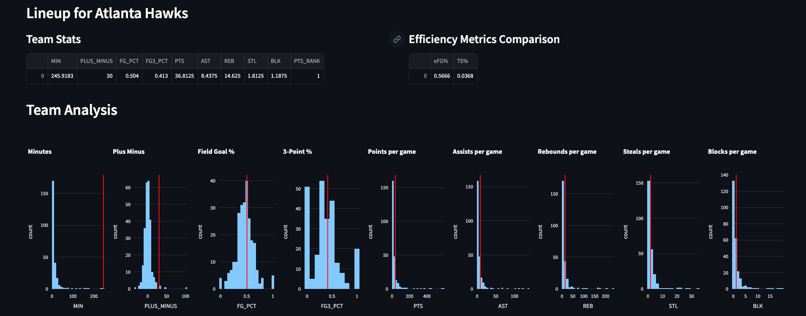

# NBA Lineup Analysis Tool

## Description

The NBA Lineup Analysis Tool is a web application built using Streamlit to analyze and compare different NBA team lineups and player statistics. The tool allows users to select a team and a specific lineup, and then presents a comprehensive analysis of various performance metrics for the selected lineup. Users can also compare two teams based on specific statistics to gain insights into their relative strengths and weaknesses.

## Features

- Interactive web-based tool for NBA lineup analysis and comparison.
- Selection of NBA teams and lineups using intuitive user interface.
- Display of key performance metrics such as points, field goal percentage, assists, rebounds, steals, blocks, and more.
- Calculation and visualization of advanced metrics like Player Efficiency Rating (PER), True Shooting Percentage (TS%), and Effective Field Goal Percentage (eFG%).
- Interactive histograms for visualizing team and player statistics.
- Text-to-speech functionality for player names and lineup details.
- Comparison of two teams based on user-selected performance metrics.

Website Link: https://nbaanalysis-jd6oodyc3uurmtwm5euidk.streamlit.app/
## Installation

1. Clone the repository:
git clone https://github.com/mujtabach2/nbaAnalysis.git

2. Install the required Python packages:
pip install -r requirements.txt

3. Download the NBA lineup dataset 'NBALineup2021.csv' and place it in the project folder.

## Usage

1. Run the Streamlit app:
streamlit run main.py

2. On the web application, select the desired NBA team and a lineup from the available options.

5. Use the dropdown to choose specific performance metrics for sorting the lineup.

4. The app will display the selected lineup's statistics, including points, field goal percentage, assists, rebounds, steals, blocks, and more.

6. The app will calculate and display advanced metrics such as Player Efficiency Rating (PER), True Shooting Percentage (TS%), and Effective Field Goal Percentage (eFG%).

8. To compare two teams, select a second team from the dropdown and choose a performance metric for comparison. The team's lineup will be the highest-ranked according to the performance metric

## Acknowledgments

- The NBA lineup data used in this project is sourced from [NBA Lineups](https://www.nba.com/stats/lineups/).
- The Streamlit library was used to create the interactive web application.
- Visualization of data was made possible using Plotly Express.

